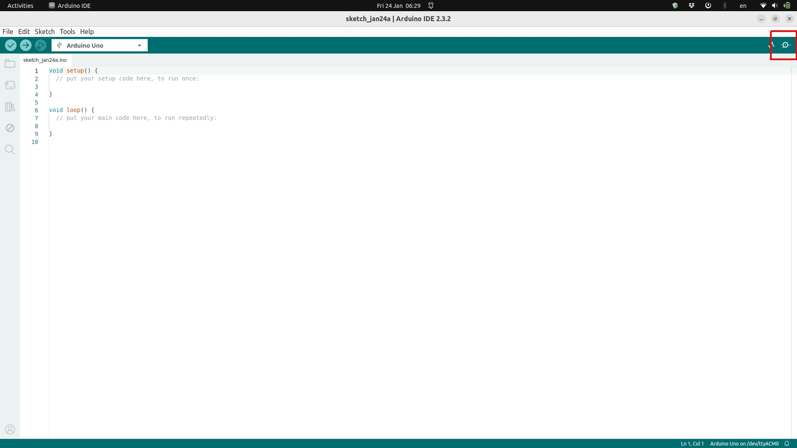
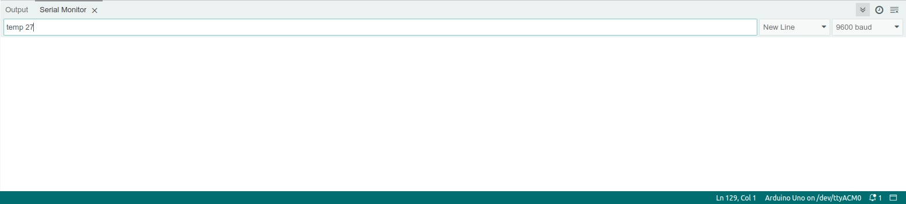

---
Details:
    #Thumbnail: images/<Your Image>.jpg
    Time: 30 Minutes
    Difficulty: Easy
    Skills:
      - computer use
---
<!-- There should be only one Header per page. You do not need to use all the keys -->

# Using the system

Currently the system relies on manual input from users to set the final temperature of the stimulator. This is done by using the Arduino-IDE and sending formatted commands using its "serial monitor". This will send a message to the ESP32 microcontroller, which will them perform the necessary actions for the Peltier element heat up or cool down, and for the temperature sensor to send back information to make sure the temperatures are within the expected range. 

## Steps:


- Open the Arduino-IDE
- Select the correct board on the dropdown menu on the top left.
- Click the Serial monitor icon on the top right (see image below)



<br>

- with the serial monitor open, make sure "9600 baud" is selected on the right dropdown menu and "New Line" is selected on the menu next to it (see image below).  
    - These two things ensure messages going between the microcontroller and the computer are properly formatted.

<br>



- if everything is working properly, users should see a series of messages printed in the serial monitor window, namely "current temperature: XX C", indicating that the ESP32 is sending information about the temperature sensor to the computer. 

- to set new temperatures, users need to type a message on the text box of the serial monitor, with the following format (case-sensitive): ``` temp 30 ```. 
    - Here "temp" is the keyword expected by the ESP32 to set a new temperature. "30" in this case would bring the temperature at the peltier element to 30 degrees Celsius. Please note that there is a space between "temp" and "30".  


>! **Caution** 
>!
>! Remember that the peltier will very likely be attached to someone's skin! So be careful with setting the temperature. For safety reasons, we control the maximum temperature to XXXX, so that even if users mistakenly type something like "temp 100", the system will not allow that to happen.


 


