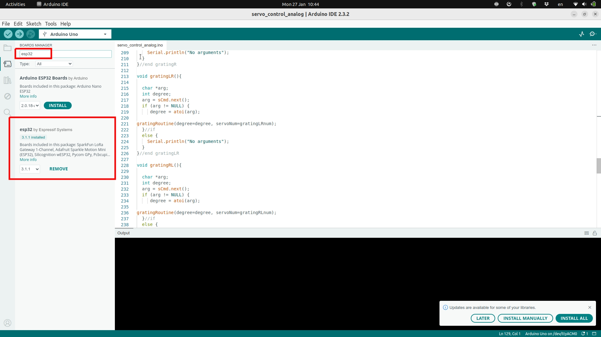

---
Details:
    Thumbnail: images/gh_repo001.jpg
    Time: 30 Minutes
    Difficulty: Easy
    Skills:
      - Computer use
---

# Prepare microcontroller

This system runs on a microcontroller called ESP32, specifically, the [ESP32-WROOM](https://www.espboards.dev/esp32/esp32-wroom/) model. 

For this application, the microcontroller runs custom code, written in a simplified version of C++ (referred to as Arduino language). In order to use the system we require a working computer (Windows, Mac or Linux), and for the setup, access to the Internet.

 

### The steps for setting up for the first time are: {pagestep}

* Download and install the Arduino Integrated Development Environment ([Arduino IDE](https://docs.arduino.cc/software/ide/#ide-v2)) - Follow this [**tutorial**](https://docs.arduino.cc/software/ide-v2/tutorials/getting-started/ide-v2-downloading-and-installing/)

* Add, to the Arduino IDE, the board definitions for the ESP32 microcontroller - Follow this [**tutorial**](https://docs.arduino.cc/software/ide-v2/tutorials/ide-v2-board-manager/)
    * the board definitions we are looking for are "ESP32 by espressif (see screenshot below)"

* Run the Arduino IDE for the first time and make sure it is configured properly - Follow this [**tutorial**](https://docs.arduino.cc/software/ide-v2/tutorials/getting-started-ide-v2/)

>! **Caution** 
>! Some window users might need to install drivers for their computers to recognised the ESP32 board properly. Please follow this [tutorial](https://randomnerdtutorials.com/install-esp32-esp8266-usb-drivers-cp210x-windows/)
>! Caution message

### running the skin thermal stimulator code on the board: {pagestep}

* Once you have the microcontroller properly connected to the computer, we can download the custom code written for this project. If there are updates to the code, or users want to design their own routines, they will need to perform this step again.

* Download the custom code from its [publicly available repository](https://github.com/Sussex-Neuroscience/skin_thermal_stimulator)
    * Click on the Green "code" button, and then on "download zip" (see screenshot below). This will download a single zip file containing everything available in the repository, including our code.  

           

    * Unzip the file, and navigate to the code folder. In it, navigate to the "main_arduino" folder and double click the file named "main_arduino.ino" (in some computers the termination ".ino" might be omitted).

kjsdj

 

